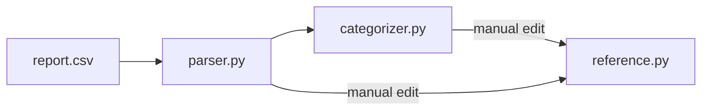

# cash-flow-tracker-tool

For personal usage of cashflow records analysis and visualization, based on reports generated from payment apps.

1. Parse the account-specific report files to account-monthly-files with pre-defined columns in CSV
   1. Load data from account's CSV/Excel/etc file
   2. Populate column values based on direct mapping from the report file
   3. Use embedding similarities to populate categories
2. Combine the account-monthly-files of each account into one all-accounts-monthly-file; combine the all-accounts-monthly-file to yearly-files
3. Generate analysis 

### Step 1 Report Files Parsing - Breakdown

## Project Structure - Main Components

- `src/main.py`
  - The entry point of the program
- `src/parser/`
  - The entry point of the parsing stage
- `src/parse_strategy/`
  - Utilizing the Strategy Design Pattern to parse files for different payment platforms
  - All strategy classes inherit from `parse_strategy_base.py`
- `src/categorizer/`
  - The categorizer that determines the category of each cashflow entry using embedding vectors comparison
- `src/cleanser/`
  - Helpful scripts to mark the entries with manually edited category as `category_resolver = "manual"` 
- `src/combiner/`
  - Combining account-specific files into the complete output CSV (including all accounts)
- `src/analyzer/` (TODO)
  - For analyzing the report, and visualizing the aggregated data